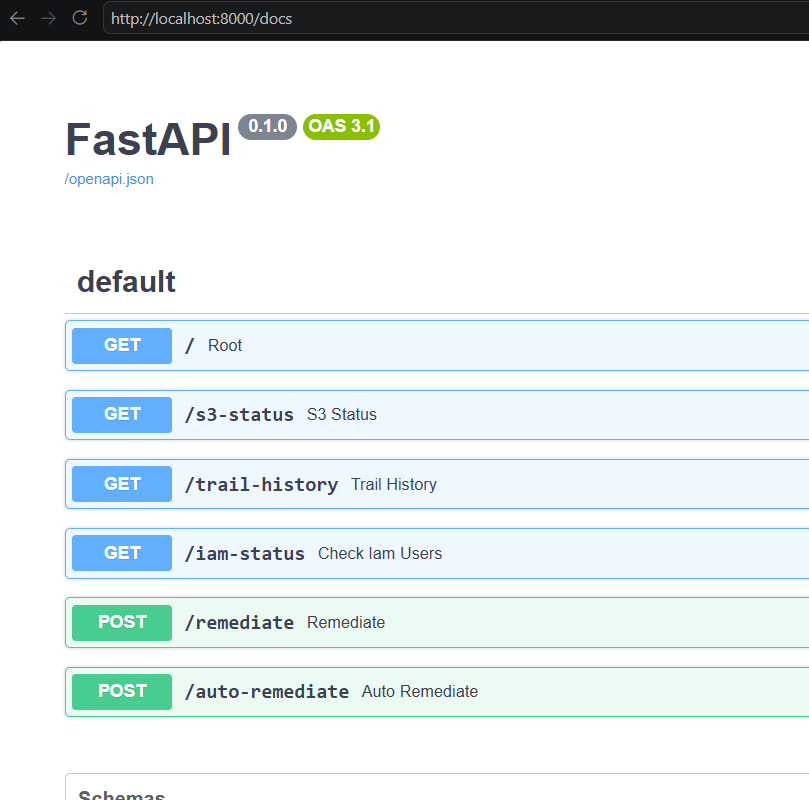
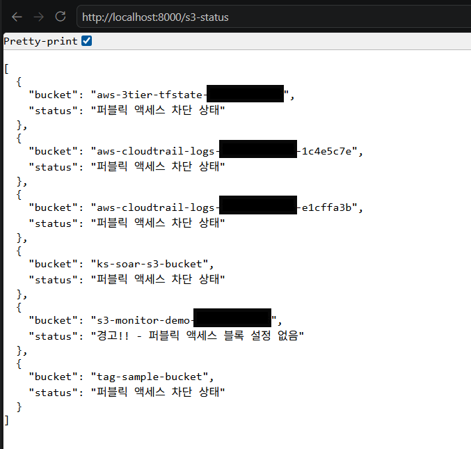
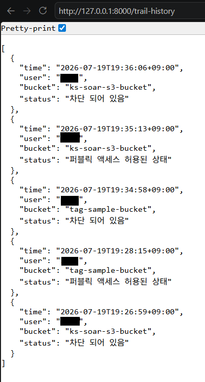
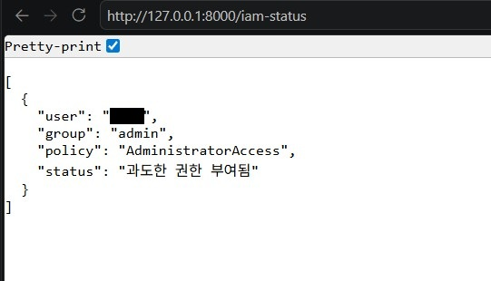
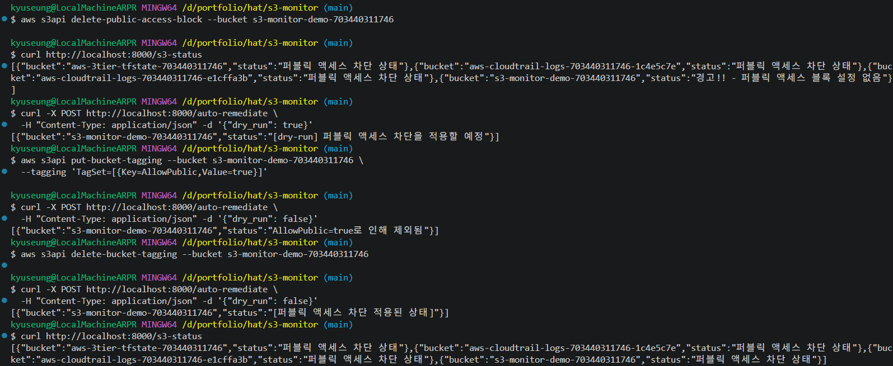
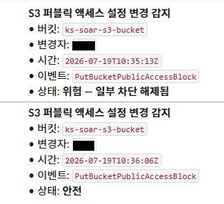

# AWS S3 인프라 자동 점검 시스템

## 프로젝트 개요

Terraform으로 프로비저닝한 S3 인프라의 설정 변경을 CloudTrail로 추적하고, IAM 사용자의 권한 설정을 점검하는 AWS 인프라 자동 점검 시스템이다.
반복적인 점검 작업을 코드로 자동화하고, 안전하게 조치할 수 있는 구조를 목표로 한다.

> 이 프로젝트에서 느낀 "탐지 이후"의 필요성이
> [aws-3tier-infra](https://github.com/winterconquest/aws-3tier-infra)로 이어졌다.
> 그쪽은 인프라를 직접 설계·구축하고 장애 복구와 모니터링을 실측 검증한 프로젝트다.

### 준실시간 탐지 흐름

S3 설정 변경 → CloudTrail 기록 → EventBridge 캐치 → Lambda 호출 → Slack 알림

### 보안 운영 관점에서의 기능

- IAM 권한 점검 모듈은 결과적으로 접근제어 정책이 의도대로 적용되고 있는지 검증하는 기능이다.
- S3 퍼블릭 액세스 점검은 보안 설정 상태를 지속적으로 관리하며 오탐지, 미탐지 없이 위험 설정을 걸러내는 기능이다.


## 배경

시스템 운영 업무를 하면서 느낀 점은, 점검 작업이 사람에 의존하는 한 누락과 일관성 문제가 발생하기 쉽다는 점이었다.
정형화된 작업을 코드로 자동화하면 점검 누락을 줄이고, 무엇보다 일관성 있는 기준을 적용할 수 있겠다고 판단했다.

한편 자동화는 이점만큼 위험성도 있기에, 단순 탐지에서 멈추지 않고 안전한 조치까지 함께 설계하는 것을 목표로 했다. 
점검 결과를 사람이 확인할 수 있는 형태로 노출하고, 조치는 명시적으로 분리해 의도하지 않은 변경을 막는 구조를 지향한다.


## 아키텍처

```
Terraform
├── S3 버킷 프로비저닝 (퍼블릭 액세스 차단, KMS 암호화, 버전 관리, 로깅)
└── 준실시간 알림 시스템 (EventBridge + Lambda + Slack)

boto3 + FastAPI
├── /s3-status       → S3 퍼블릭 액세스 설정 점검
├── /trail-history   → CloudTrail 설정 변경 이벤트 추적
├── /iam-status      → IAM 사용자 권한 상태 점검
├── /remediate       → 단일 버킷 조치 (dry-run 기본, 태그 기반 예외 처리)
└── /auto-remediate  → 점검 결과 기반 위험 버킷 일괄 조치 (dry-run 기본)


```



> 조회는 GET, 상태를 변경하는 조치는 POST로 분리

## 점검 시나리오

1. Terraform으로 퍼블릭 액세스가 차단된(기본값) S3 버킷 생성
2. 해당 버킷 설정 권한자가 퍼블릭 액세스 허용으로 변경
3. /s3-status에서 퍼블릭 액세스가 허용된 상태를 감지
4. /trail-history에서 해당 설정 변경 이벤트를 추적하여 변경자, 대상 버킷, 변경 시각, 변경 내용을 확인
5. /iam-status에서 IAM 사용자, 소속 그룹, 정책 목록을 조회해 불필요하게 부여된 권한이 있는지 점검
6. /auto-remediate에서 위험으로 식별된 버킷을 일괄 조치 (dry-run 기본, 태그 예외 적용)
7. 위험 변경 발생 시 EventBridge → Lambda → Slack으로 운영자에게 준실시간 알림

### 실행 결과



> 각 버킷의 퍼블릭 액세스 차단 여부를 실제로 점검한 응답



> 변경 시각·변경자·대상 버킷·변경 내용을 CloudTrail에서 추적



> AdministratorAccess가 부여된 사용자를 탐지한 응답

## Remediation 모듈

단순 점검에서 멈추지 않고, 위험한 설정을 자동으로 조치하는 모듈이다.
자동화의 안전성을 우선해 다음 두 가지 원칙으로 설계했다.

- **dry-run 모드 기본값**: 함수 인자에 `dry_run=True`를 기본값으로 설정.
  실제 변경 작업은 `dry_run=False`를 명시적으로 전달해야만 실행됨.
  의도하지 않은 호출에서 시스템을 보호하는 "safe default" 패턴.

- **태그 기반 예외 처리**: `AllowPublic=true` 태그가 부여된 리소스는 조치 대상에서 제외.
  버킷 소유자가 자기 책임으로 태그를 부여하고, 자동화 코드는 그것을 신뢰. 권한과 책임의 자연스러운 분리.

- **detection-remediation 통합**: `/auto-remediate`가 점검 결과를 받아 위험 버킷만 선별 조치. 
  단일 버킷용 `/remediate`와 같은 안전장치(dry-run, 태그 예외)를 일괄 처리에도 그대로 적용.

### 동작 확인

두 안전장치가 각각 독립적으로 작동하는지 검증했다.

| 조건 | 요청 | 결과 |
|---|---|---|
| 퍼블릭 액세스 블록 미설정 | `/s3-status` | 위험 감지 |
| 태그 없음 | `dry_run=true` | 조치하지 않고 적용 예정 사항만 반환 |
| `AllowPublic=true` 태그 있음 | `dry_run=false` | **조치하지 않고 제외** |
| 태그 제거 후 | `dry_run=false` | 퍼블릭 액세스 차단 적용 |



> 세 번째 항목이 핵심이다. 실제 조치를 요청(`dry_run=false`)했음에도 태그가 있는
> 버킷은 건너뛴다. 태그 예외는 dry-run 여부와 무관하게 독립적으로 적용된다.

## 준실시간 알림 시스템

S3 설정 변경이 발생하는 즉시 운영자에게 알림이 도착하는 이벤트 기반 시스템이다.
주기 점검에 의존하지 않고 변경 발생 시점에 인지할 수 있다.

- **이벤트 감지**: CloudTrail에 기록된 PutBucketPublicAccessBlock API 호출을 EventBridge가 준실시간으로 잡는다.
- **알림 처리**: Lambda 함수(Python 3.12)가 이벤트에서 버킷명, 변경자, 시간, 차단 상태를 추출하고 Slack 메시지로 보낸다.
- **외부 의존성 없음**: Lambda는 표준 라이브러리 `urllib`만 사용합니다. 외부 패키지 패키징 없이 동작한다.
- **민감 정보 관리**: Slack Webhook URL은 Terraform 변수(`terraform.tfvars`)로 분리하고 `.gitignore`로 유출 방지한다.
- **IaC**: 알림 시스템 전체 (Lambda, IAM Role, EventBridge 규칙, 권한)를 Terraform으로 정의했다.



> 퍼블릭 액세스 변경 시 상태(위험/안전)에 따라 즉시 알림 전송

## 기술 스택

- Terraform : 인프라의 코드화 및 버전 관리 (IaC)
- Trivy : 유지보수가 중단된 tfsec의 기능을 흡수한, 배포 전 환경 취약점을 확인하는 보안 스캐너. 스캔 결과는 `terraform-s3-security/reports/`(IaC)와 `reports/`(컨테이너 이미지) 참고
- boto3 : 파이썬 코드만으로 AWS 서비스 상태를 점검하고 안전하게 조치
- CloudTrail : AWS 서비스의 API 호출 이력을 기록해 설정 변경 추적
- FastAPI : 점검 결과를 API 엔드포인트로 제공
- Docker : 애플리케이션 컨테이너화 (이식성, 환경 격리)
- EventBridge : CloudTrail 이벤트 기반 준실시간 알림 트리거
- Lambda : 알림 메시지 포맷팅 및 Slack 전송 (Python, 외부 의존성 없음)
- Slack Incoming Webhook : 운영자에게 준실시간 알림 채널

## 실행 방법

### Docker로 실행

```bash
# 이미지 빌드
docker build -t s3-monitor .

# 컨테이너 실행 (AWS 자격증명 마운트)
docker run -v ${HOME}/.aws:/root/.aws -p 8000:8000 s3-monitor

# 브라우저에서 http://localhost:8000/docs 접속
```

AWS 자격증명은 호스트의 `~/.aws/` 폴더를 컨테이너에 마운트하는 방식으로 전달한다. 운영 환경에서는 IAM Role 사용을 권장한다.

## 한계 및 개선 계획

| 항목 | 현재 | 개선 방향 |
|---|---|---|
| 인증 | API에 인증 계층 없음 | API Key 또는 IAM 기반 인증 계층 추가 |
| Lambda 실패 처리 | 재시도·DLQ 미구성 | SQS DLQ 연결 후 실패 이벤트 보존 |
| 탐지 지연 | CloudTrail 기록까지 수 분 소요 | 즉시성이 필요하면 S3 이벤트 알림 직접 구독 검토 |
| 페이지네이션 | 버킷·사용자 목록 미처리 | boto3 Paginator 적용 |
| Terraform state | 로컬 파일 | S3 원격 backend로 전환 (3-tier에 적용 완료) |
| 태그 예외 처리 | `AllowPublic=true` 부여만으로 조치 제외 | 태그 부여 이력을 CloudTrail로 별도 감사 |
| 인증 | API 엔드포인트에 인증 없음 | 운영 시 인증·인가 계층 필요 |
| 자격증명 | `~/.aws` 마운트 | EC2/ECS에서는 IAM Role, 로컬은 임시 자격증명 |